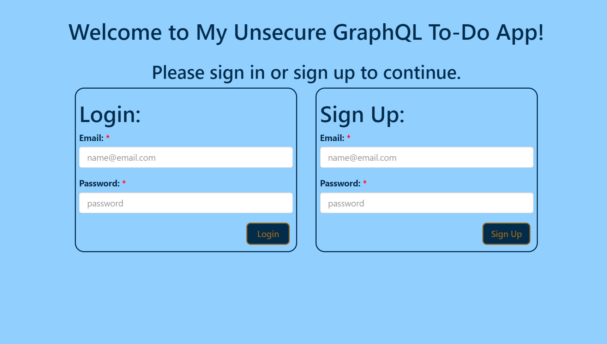
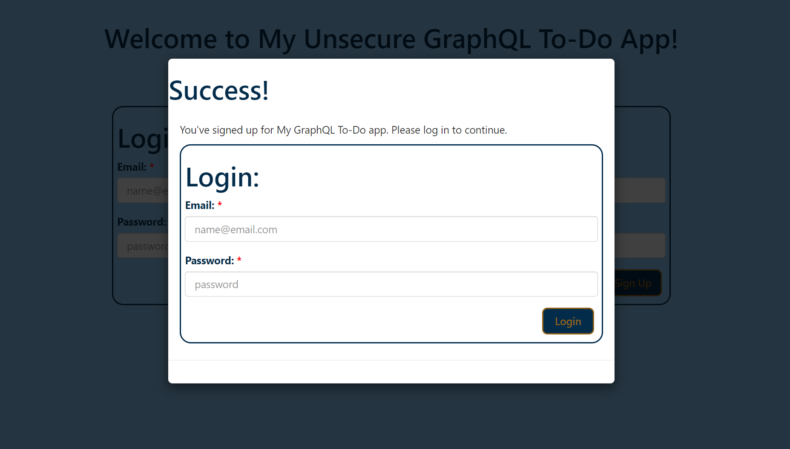
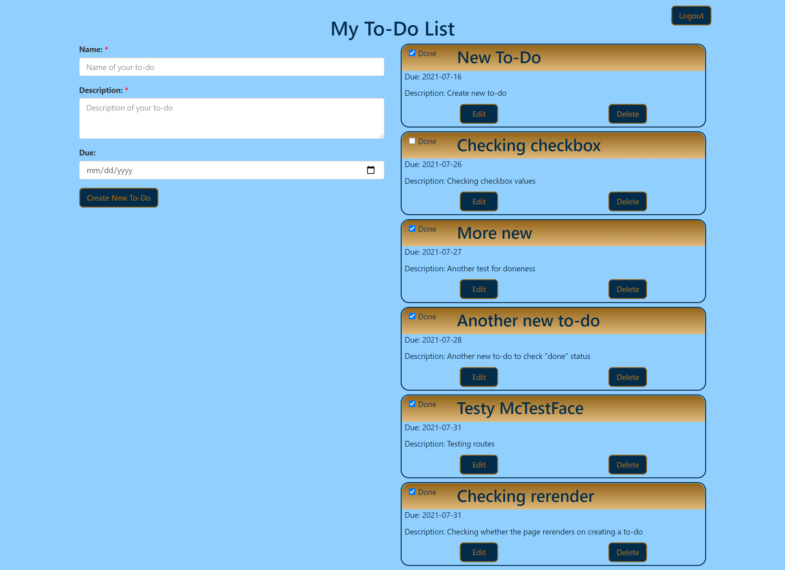

# graphQLToDo

## Table of Contents

* [Description](#description)
* [Links](#links)
* [Screenshots](#screenshots)
* [Installation Instructions](#installation-instructions)
* [Usage](#usage)
* [Technologies Used](#technologies-used)
* [Tests](#tests)
* [Credits](#credits)
* [Contributing](#contributing)
* [Questions](#questions)
* [Badges](#badges)

## Description

This application uses a MERN stack with GraphQL to create a to-do list.

## Links

[Deployed application on Heroku](https://my-gql-todos.herokuapp.com/)

## Screenshots

Landing page:

Login after signing up:

To-Dos page:

## Installation Instructions

npm install

## Usage

This project is GraphQL practice. The sign-in is ***NOT*** secure, and nor is it intended to be.

## Technologies Used

     

## Tests

npm run test

## Credits

Thanks to [Zac Stowell](https://github.com/the-medium-place) for the idea!

## Contributing

I believe code is never finished, and welcome your contributions to enhance the application's functionality. Please adhere to the Code of Conduct for the Contributor Covenant, version 2.0, at https://www.contributor-covenant.org/version/2/0/code_of_conduct.html.

## Questions

If you have further questions, you can reach me at lauracole1900@comcast.net. For more of my work, see [my GitHub](https://github.com/LauraCole1900).

## Badges

 